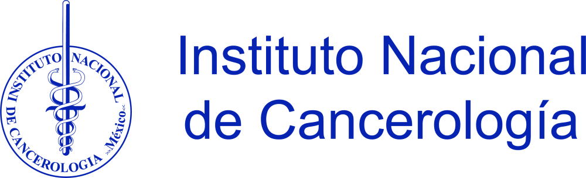
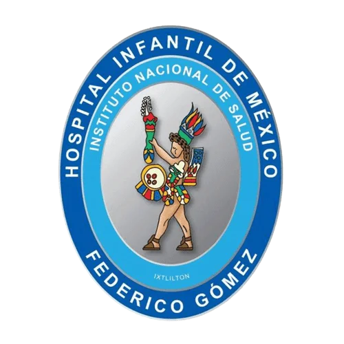

::: {.alert .alert-dismissible .alert-primary}
Standing at the intersection of Nutrition, Proteomics, and Immunology, our lab studies mucosal regulation in cancer, inflammation, and immunity. Intestinal immune homeostasis is maintained by a fine balance between the pro- and anti-inflammatory responses to microbiota. An extensive network of antigen presenting cells and effector cells tightly regulate these responses. We focus primarily on 1) the role of nutrition on immune responses and 2) macrophages regulation of intestinal T cells and epithelial cells, in health and disease.
:::

## Latest news

::: {#latest-news}
:::

[See all news](news.qmd)

## Research areas

Our group employs clinical interventions, immuno-proteomic, flow cytometry, proteomics and genomic methods, cell biology, biochemistry and *in vivo* models to reveal new intestinal immune regulation mechanisms.

We combine our expertise to gain novel insight on basic research questions, and we aim for translating our findings into clinical applications and therapeutic interventions to promote human health.

## Principal Investigators

**Denisse Castro-Eguiluz** is a Researcher for México at the National Cancer Institute, where she works on cervical cancer. **Oscar Medina-Contreras** is a medical sciences researcher at Mexico Children’s Hospital, where he works on mucosal immunology.

:::{.columns}
::: {.column width="50%"}
[{width="100%" fig-align="center"}](https://www.incan.salud.gob.mx)
:::
::: {.column width="50%"}
[{width="35%" fig-align="center"}](https://www.himfg.edu.mx/)
:::
:::

## Get Involved

If you are interested in immunometabolism, flow cytometry, cell biology, and *in vivo* models to reveal new immune regulation mechanisms, don’t hesitate to join our group.

We combine our expertise to gain novel insight on basic research questions, and we aim for translating our findings into clinical applications and therapeutic interventions to promote human health. We are always looking for enthusiastic, motivated and talented people, at all career stages, to join our team!

::: {.callout-warning}
Following our [Instagram](https://www.instagram.com/omc_lab/) may cause sudden bursts of curiosity and accidental intelligence.
:::

## Ongoing research projects

::: {#ongoing-projects}
:::

[See all projects](projects.qmd)
