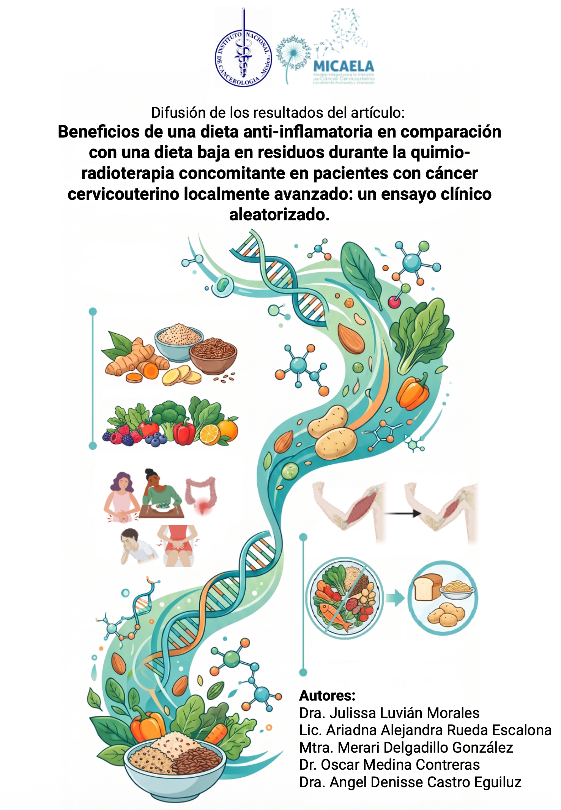

::: {.callout-important}

Hace algunos años, se sabía muy poco sobre qué alimentación debían llevar las personas con cáncer
que recibían tratamientos como la quimioterapia o la radioterapia. Por eso, las recomendaciones sobre
qué comer se basaban más en creencias y experiencias que en evidencia científica.

:::

**Para más información da click a la imágen**

[{width="100%" fig-align="center"}](difusion.pdf)
