::: {.callout-note}
# CongreCito

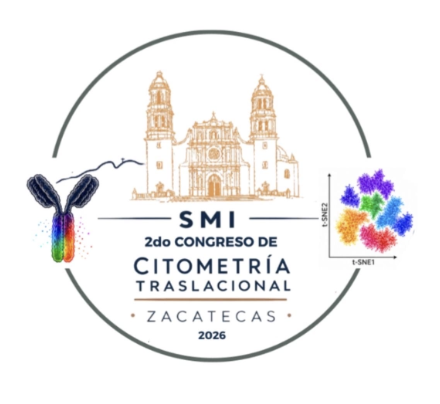
:::

::: {.callout-note}
# ESPEN

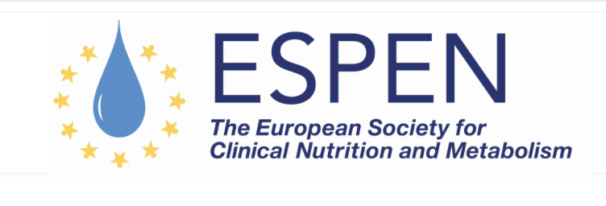
:::

::: {.callout-note}
# Congreso del 60 Aniversario de la Asociación Psiquiátrica Mexicana

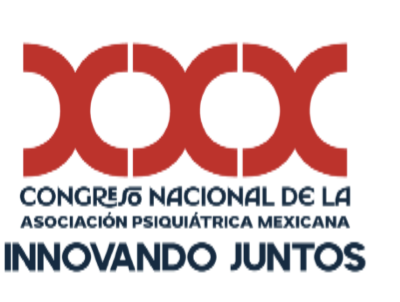
:::

::: {.callout-note}
# CICSA

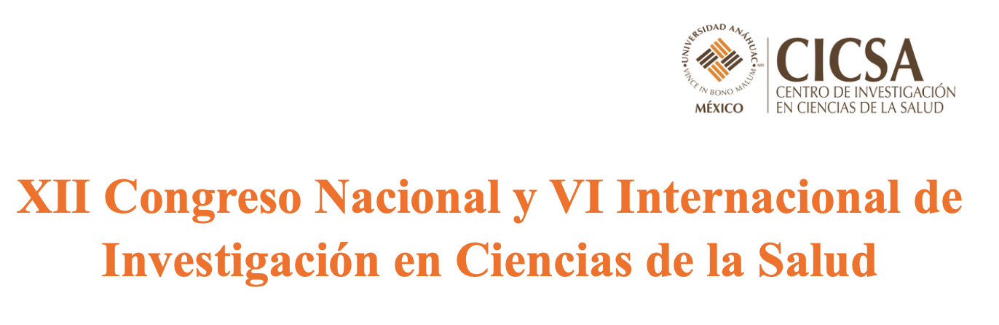
:::

::: {.callout-note}
# ICO

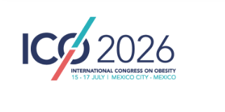
:::

::: {.callout-note}
# ALADS

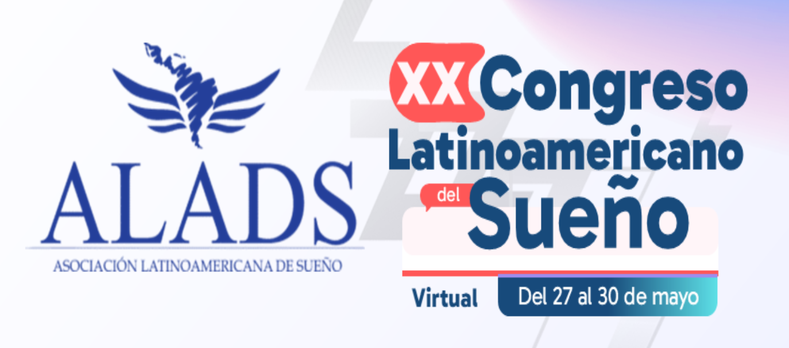
:::

::: {.callout-note}
# ISDA

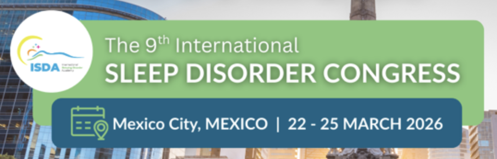
:::

::: {.callout-note}
# CTV-HGM

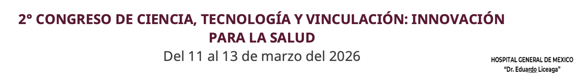
:::

::: {.callout-note}
# RAI-INPer

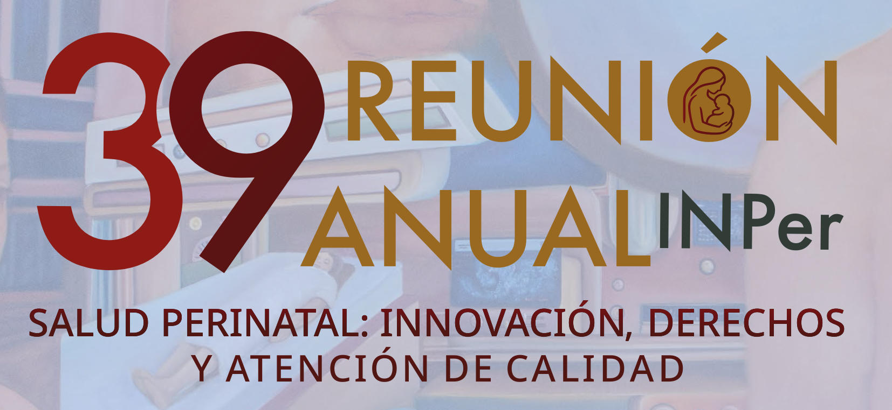
:::

::: {.callout-note}
# Mujer en la Ciencia

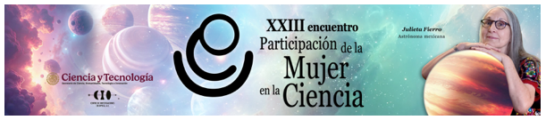
:::

::: {.callout-note}
# Relevancia de la respuesta inflamatoria en los trastornos psiquiátricos

:::

::: {.callout-note}
# Diplomado Internacional de Medicina del Sueño

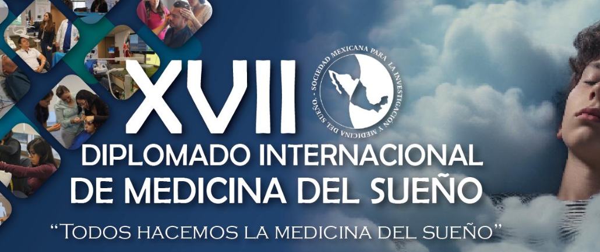
:::

::: {.callout-note}
# Congreso de Biomedicina Molecular

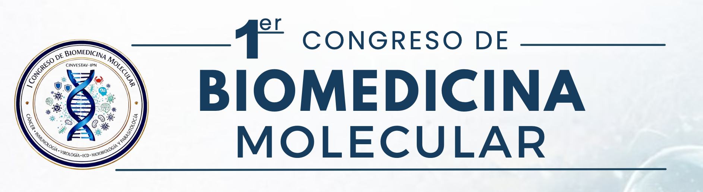
:::